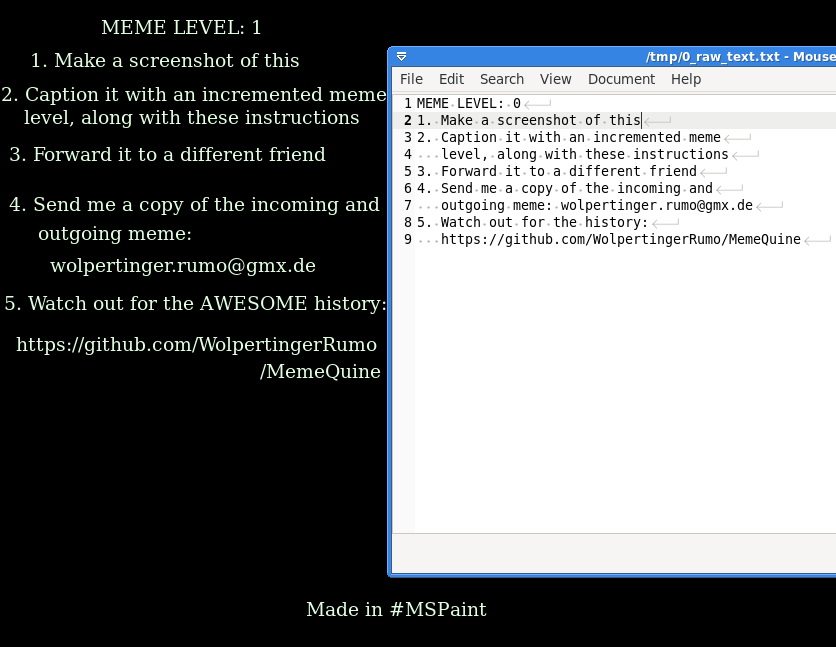

# Meme Quine

A [varying, mutating, competing, inheriting idea](https://en.wikipedia.org/wiki/Meme)
that can [reproduce itself](https://en.wikipedia.org/wiki/Quine_(computing)).

## Evolution

### MEME LEVEL 0

```
MEME LEVEL: 0
1. Make a screenshot of this
2. Caption it with an incremented meme
   level, along with these instructions
3. Forward it to a different friend
4. Send me a copy of the incoming and
   outgoing meme: wolpertinger.rumo@gmx.de
5. Watch out for the history:
   https://github.com/WolpertingerRumo/MemeQuine
```

### MEME LEVEL 1



## But why?

Because.
